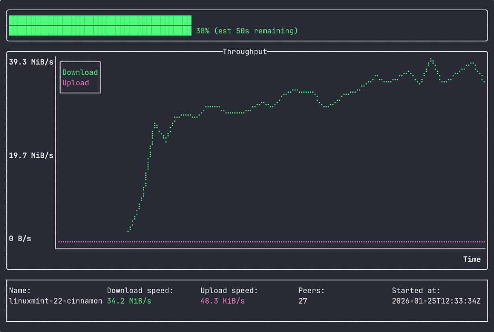
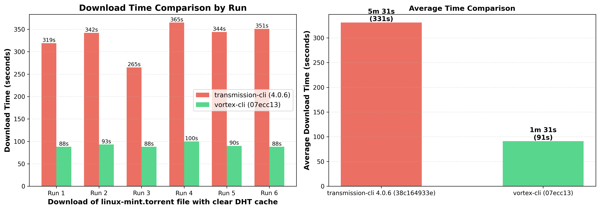

# Vortex

[](https://crates.io/crates/vortex-bittorrent)
[](https://docs.rs/vortex-bittorrent)
[](LICENSE)

- [vortex-bittorrent](#vortex-bittorrent) is an extremely fast, pure `io_uring` based BitTorrent library built from the ground up to maximize performance on modern Linux kernels and hardware.
- [vortex-cli](#vortex-cli) is the first client (of hopefully many) built using `vortex-bittorrent` and is a fully trackerless TUI client demonstrating the capabilities of the library.




## Project status

The project could be considered in a BETA state. The core of the implementation is fast and stable but there are features missing (for example [pausing torrents](https://github.com/Nehliin/vortex/issues/92) or [PEX peer exchange](https://github.com/Nehliin/vortex/issues/91)). The implementation is also thouroughly tested with unit, fuzz and integration tests and I have tested it manually on various hardware. With that said, `vortex-bittorrent` is not yet widely used. I expect there to be some stability issues as the project matures. Bug reports and feedback is welcome!

## System Requirements

**Minimum Linux Kernel Version: 6.1** since I optimize for modern kernels and hardware.


## Performance

The goal of the library is to be the fastest BitTorrent implementation on Linux. It's hard to fairly and properly benchmark implementations against each other but anecdotaly `vortex-cli` is around **x3 times faster** downloading than `transmission-cli (4.0.6)` on the same hardware and network conditions. If you have another bittorrent implementation that's faster than vortex it would be considered a bug. I won't claim to be the fastest until I have proper benchmarking and comparision against more implementations.



The comparison was done using following for transmission: 
```
rm -rf ~/.config/transmission && rm -rf ~/Downloads/linuxmint-22-cinnamon-64bit.iso
time transmission-cli -f <script that terminates process> -D linux-mint.torrent
```

And this for vortex-cli, time was taken from the reported value in the TUI when completed:
```
rm -rf downloads/ && rm -rf ~/.cache/vortex
vortex-cli -t linux-mint.torrent -d downloads
```

### Why is it fast
- **io_uring**: Is the next generation I/O api for Linux that limits syscall overhead and significantly improves I/O compared to the traditional `epoll` async model. Vortex not only uses io_uring, but optimizes for performance over kernel compatibility which means the latest and greatest apis can be utilized.
- **Custom event loop**: No async runtime overhead. The library excersies direct control over the I/O operations for maximum throughput.
- **Built for modern hardware**: The implementation assumes you are running on SSD or NVMe drive and wastes no cycles trying to optimize write head locations which is critical for older HDDs
- **Parallel hash computations**: All piece hashing is offloaded to a separate thread pool keeping the I/O loop unblocked.
- **"Lockless" implementation**: All I/O operations are handled by a single thread and pieces are shared to the hashing thread(s) using Rusts lifetime guarantees. This means no locking and not even `Arc` is necessary.

## Why Vortex?

- [Performance](#performance) 
- **Well tested**: The implementation contains a lot of both unit, integration and fuzz tests. 
- **Observability**: Metrics are critical for observability and supported. See [metrics integration](#metrics-integration). 

## Why not Vortex?

- You want to support more platforms than just Linux
- You want to be compatible with older kernel versions
- You want to support older hardware like HDDs


## vortex-cli


`vortex-cli` is a simple TUI client is built as a completely trackerless bittorrent client which means all peer discovery is done via the DHT (distributed hash table). The DHT implementation comes from the excellent [mainline](https://github.com/pubky/mainline) crate.

You can easily configure the settings for the cli by modifying the config file that's saved by default in `~/.config/vortex/config.toml`. To see the commented available settings in [the config example](https://github.com/Nehliin/vortex/blob/master/cli/vortex.config.toml.example)

### Installation

```
cargo install --locked vortex-cli
```

### Magnet links

`vortex-cli` doesn't support magnet links (yet). But you do not have to provide a full metadata file since it can download it from the swarm. It's enough to simply provide the info-hash of the torrent you want to download using the `--info-hash` flag.

### Quick Start

```
vortex-cli --info-hash <info-hash> -d downloads
```


### Usage:
```
A cli for downloading torrents using the bittorrent protocol(s). Built on top of io-uring

Usage: vortex-cli [OPTIONS] <--info-hash <INFO_HASH>|--torrent-file <TORRENT_FILE>>

Options:
  -p, --port <PORT>
          Port for the listener
  -i, --info-hash <INFO_HASH>
          Info hash of the torrent you want to download. The metadata will be automatically downloaded in the swarm before download starts
  -t, --torrent-file <TORRENT_FILE>
          Torrent file containing the metadata of the torrent. if this is provided the initial metadata download will be skipped and the torrent downlaod can start immediately
  -c, --config-file <CONFIG_FILE>
          Path to the config file (defaults to $XDG_CONFIG_HOME/vortex/config.toml) the file will created it if doesn't already exists
  -d, --download-folder <DOWNLOAD_FOLDER>
          Path where the downloaded files should be saved (defaults to $XDG_DATA_HOME/vortex/downloads)
      --log-file <LOG_FILE>
          Log file path (defaults to $XDG_STATE_HOME/vortex/vortex.log)
      --dht-cache <DHT_CACHE>
          DHT cache path (defaults to $XDG_CACHE_HOME/vortex/dht_bootstrap_nodes)
  -h, --help
          Print help
  -V, --version
          Print version
```


## vortex-bittorrent

Currently the [following BEPs](#relevant-bep-implementation-status) have been implemented. I have also looked at the excellent [libtorrent](https://github.com/arvidn/libtorrent) implementation when BEPs have been underspecified or unclear.

As mentioned earlier, the library uses a custom runtime/event loop instead of any existing `async` io uring libraries (I've tried multiple) for maximum control over the lower level details of the implementation. The over all implementation is multi-threaded but uses a single `io_uring` thread for all I/O operations. The other threads are used for calculating piece hashes to avoid blocking the main loop.

Communication with the main torrent thread is done via the [Command](https://docs.rs/vortex-bittorrent/latest/vortex_bittorrent/enum.Command.html) message. You receive updates of the torrent progress via the [TorrentEvent](https://docs.rs/vortex-bittorrent/latest/vortex_bittorrent/enum.TorrentEvent.html) message.

For maximum performance it's key to tweak the [config](https://docs.rs/vortex-bittorrent/latest/vortex_bittorrent/struct.Config.html) for your specific setup. Also ensure your various `ulimit` limitations aren't to strict. You may want to raise the limits as well for maximum performance.


### Usage

See the [basic_download integration test](https://github.com/Nehliin/vortex/blob/master/bittorrent/tests/basic_download.rs) for a minimal example of how to use the library.


### Metrics integration 

`vortex-bittorrent` have support for the [metrics](https://docs.rs/metrics/latest/metrics/) crate for thourough observability when using the `metrics` feature flag. There is an example grafana dashboard I personally use in `dashboard.json`


### Relevant BEP Implementation Status

| BEP | Title | Status |
|-----|-------|--------|
| 3 | The BitTorrent Protocol Specification | Implemented |
| 6 | Fast Extension | Implemented |
| 7 | IPv6 Tracker Extension | Not Implemented |
| 9 | Extension for Peers to Send Metadata Files | Implemented |
| 10 | Extension Protocol | Implemented |
| 11 | Peer Exchange (PEX) | Not Implemented |
| 12 | Multitracker Metadata Extension | Won't implement now (trackerless) |
| 14 | Local Service Discovery | Not Implemented |
| 19 | WebSeed - HTTP/FTP Seeding (GetRight style) | Not Implemented |
| 20 | Peer ID Conventions | Implemented |
| 21 | Extension for Partial Seeds | Implemented |
| 27 | Private Torrents | Not Implemented |
| 29 | uTorrent Transport Protocol (uTP) | Not implemented |
| 40 | Canonical Peer Priority | Not implemented |
| 52 | The BitTorrent Protocol Specification v2 | Not Implemented |
| 54 | The lt_donthave extension | Not Implemented |


## AI policy

As you may have noticed I have a `CLAUDE.md` file in the repo and I frequently use LLM myself for bouncing ideas, doing boring work like updating or writing tests and help with some UI code in `vortex-cli`. The core implementation of `vortex-bittorrent` is hand written and thouroughly reviewed. To get across acceptable LLM usage in this repo, I've copied over the policy `cargo-nextest` uses, which I thought was great:

LLMs represent a tremendous breakthrough in software engineering. I welcome LLM-assisted contributions that abide by the following principles:

- **Aim for excellence**. For the vortex project, LLMs should be used not as a speed multiplier but a quality multiplier. Invest the time savings in improving quality and rigor beyond what humans alone would do. Write tests that cover more edge cases. Refactor code to make it easier to understand. Tackle the TODOs. Do all the tedious things. Aim for your code to have zero bugs.
- **Spend time reviewing LLM output**. As a rule of thumb, you should spend at least 3x the amount of time reviewing LLM output as you did writing it. Think about every line and every design decision. Find ways to break code.
- **Your code is your responsibility**. Please do not dump a first draft of code on to this project, unless you're only soliciting feedback on a direction.

If your LLM-assisted PR shows signs of not being written with thoughtfulness and care, such as missing cases that human review would have easily caught, I may decline the PR outright.

## License

This project is licensed under the BSD-3-Clause License - see the [LICENSE](LICENCE.txt) file for details.

